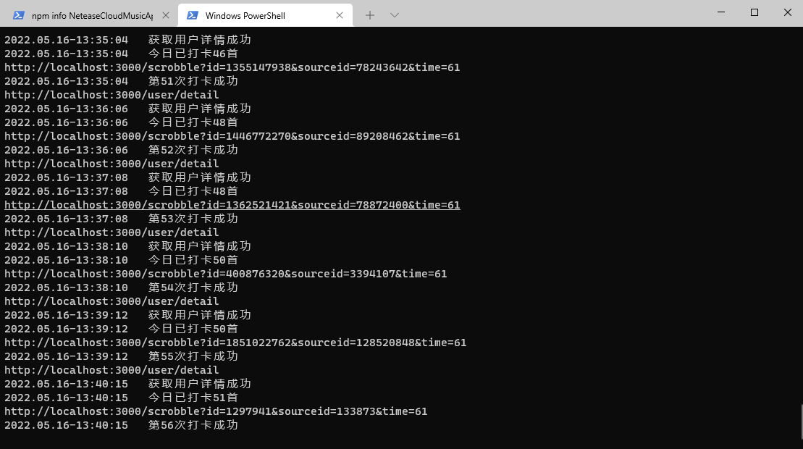
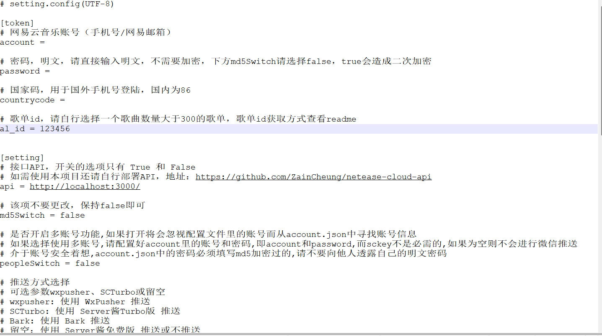

## 网易云音乐自动听歌打卡，直冲LV10

​	本项目基于[GayHub上的项目](https://github.com/ZainCheung/netease-cloud)，在此感谢原作者的付出，因为本人下载后发现不能正常使用，因此在原作上基础上修改了部分BUG，适配了网易云的最新API，使打卡功能可正常使用。

## 项目主要文件说明

account.json   开启多账号功能，此处存放多个账号信息

init.config   项目配置文件，使用时必须填写配置文件相关参数

main.py	项目主文件

requirements.txt	项目依赖库

run.log	项目日志文件

## 使用方法

**使用前必须先部署[NeteaseCloudMusicApi](https://github.com/Binaryify/NeteaseCloudMusicApi),部署完成后将部署地址填入init.config文件中的api字段内。**

`pip install -r requirements.txt  #完成项目依赖安装`  **运行过程中若提示缺少依赖，请自行安装**

打开init.config文件填写自己的账号密码。**注意：密码明文即可，不要加密，md5Switch保持false不要更改**

打开网易云音乐选择一个歌曲数量大于300首的歌单（网易API规定每天打卡上限为300首，所以程序到300首后会自动停止），歌单id获取方法为：选择歌单以链接的形式分享，链接中id=后的一串数字即为歌单id

`python main.py #运行程序`

## 说明&截图

**本项目仅供学习交流使用，若发现BUG或有新的需求请提issues，我看到后会及时处理，若感觉本项目对您有帮助请给一颗star，谢谢。**

